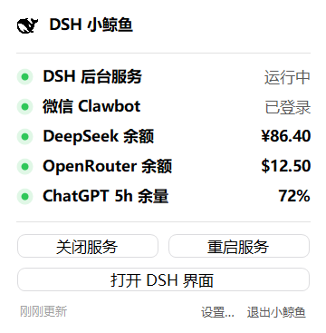

# dsh-whale for Windows 🐋

DeepSeek Harness（DSH）的 Windows 托盘助手：管理后台服务、查看余额与订阅额度、通过 DSH 原生 OAuth 登录 ChatGPT。

基于 [Orbit-Labs-AI/dsh-whale](https://github.com/Orbit-Labs-AI/dsh-whale) 移植，保留原版 Swift 源码、资源和 MIT 许可证。Windows 实现采用 C# / .NET Framework；原版 macOS 文档见 [README-macOS.md](README-macOS.md)。

## 功能

- 开启、关闭、重启 DSH；异常退出后恢复，连续启动失败时停止重试。
- 读取 DeepSeek 余额、OpenRouter 余额或 Key 限额、ChatGPT 订阅剩余额度。
- ChatGPT 登录页面使用 DSH 内置 openai-codex OAuth，授权后可在 DSH 选择 GPT 模型。
- 余额来源显示、隐藏、改名和排序；托盘菜单、权限模式和 Windows 登录自启动设置。
- 自动发现 npm 全局安装和 npx 缓存中的 DSH，不硬编码缓存目录。



截图为演示数据，实际余额需要配置相应账户。

## 从源码使用

需要 Windows、Node.js，以及已经安装并能运行的 DeepSeek Harness。使用 Windows 自带 .NET Framework 编译器，无需安装 .NET SDK。

```powershell
git clone https://github.com/genius-FXC/dsh-whale-for-Windows.git
cd dsh-whale-for-Windows
powershell -ExecutionPolicy Bypass -File .\scripts\build-windows.ps1
powershell -ExecutionPolicy Bypass -File .\scripts\setup-windows.ps1
```

双击 `启动小鲸鱼.vbs`。程序常驻任务栏通知区域，也可能位于托盘折叠菜单中。

安装脚本会备份并更新 DSH 的 web profile，注册余额插件和 ChatGPT 提供方；插件文件应保留在安装位置。已有服务未加载插件时，在小鲸鱼中重启 DSH。

## 登录 ChatGPT

1. 点击「打开 DSH 界面」，建立浏览器的本机会话。
2. 在小鲸鱼设置页或托盘菜单点击「登录 ChatGPT」，完成 OpenAI 授权。
3. 回到 DSH，在模型选择器中选择 **ChatGPT (OAuth)**（提供方 ID：`openai-codex`）下的模型。

OAuth 凭据由 DSH 保存和刷新。ChatGPT 额度查询需要已安装的 Codex CLI，目前自动发现 Windows Codex 安装目录；查询依赖实验性 app-server 接口，兼容性可能随版本变化。查询失败不影响 DSH 调用 GPT。

DeepSeek 和 OpenRouter 密钥在本机 DSH 中配置。OpenRouter 普通 Key 的限额不等同于账户余额。未配置、未登录或查询失败时显示「—」，不填入模拟余额。

## 验证与打包

```powershell
powershell -ExecutionPolicy Bypass -File .\scripts\test-windows.ps1
node --test .\tests\balances.test.mjs
powershell -ExecutionPolicy Bypass -File .\scripts\package-windows.ps1
```

安装包生成在 `dist/DSHWhale-Vibe-Windows.zip`。生命周期测试 `scripts/test-lifecycle.ps1` 会启动和关闭本项目的托盘程序，运行前应先退出已有小鲸鱼。`tests/live-gpt.mjs` 是手动启用的真实模型集成测试，会消耗少量额度，不属于默认测试。

完整说明、数据路径及平台限制见 [Windows 使用说明](README-Windows.md)。Windows 系统窗口和通知采用原生交互，不保证与 macOS 像素级一致。

## 许可与来源

[MIT License](LICENSE)。原版版权归 Alphainfix，Windows 移植保留原始署名与许可。
